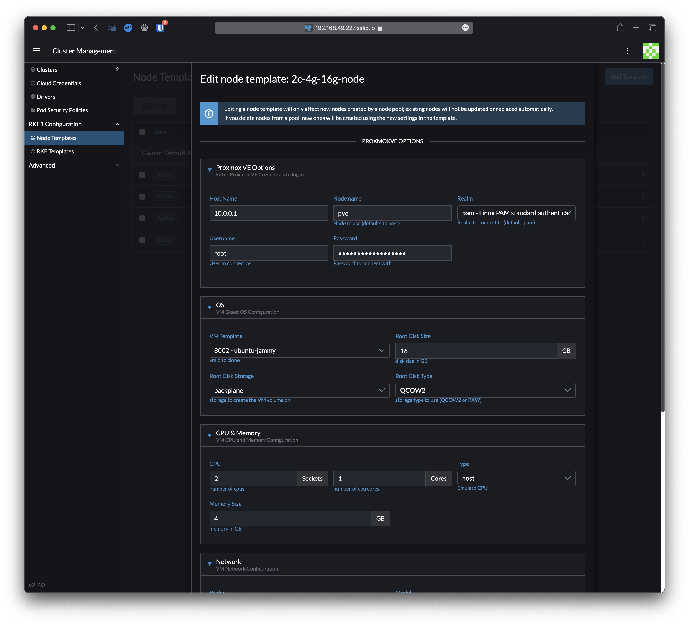

# Controlador de interfaz de usuario Rancher 2.x Proxmox VE

Controlador de interfaz de usuario de Rancher 2 para [Proxmox VE](https://www.proxmox.com/en/proxmox-ve).

## Uso del controlador de interfaz de usuario Proxmox VE

Consulte la documentación de Rancher sobre [cómo agregar un controlador de nodo](https://rancher.com/docs/rancher/v2.6/en/admin-settings/drivers/node-drivers/) a su instalación. La parte relevante está en 'Agregar controladores de nodos personalizados':

1. Desde la navegación expandible en la parte superior izquierda, seleccione Aplicaciones globales > Administración de clústeres. Luego navegue a Clústeres > Controladores. En la página Controladores, seleccione la pestaña Controladores de nodo.
1. Haga clic en Agregar controlador de nodo o simplemente active el controlador si el controlador "Proxmox" ya está presente.
1. Complete el formulario Agregar controlador de nodo. Luego haga clic en Crear:

   | Clave | Valor |
   | ----------------- | ----- |
   | URL de descarga | `https://github.com/cuza/docker-machine-driver-proxmox-ve/releases/download/v0.0.2-alpha/docker-machine-driver-proxmoxve.linux-amd64` |
   | URL de interfaz de usuario personalizada | `https://cuza.github.io/rancher-ui-driver-proxmoxve/component.js` |
   | Suma de comprobación | `8771ed1afa47a3dbc310897baacf81f7` |
   | Lista blanca de dominios | - `cuza.github.io` - `tu-proxmox-host` |

   Sugerencia: al actualizar el controlador, es posible que deba clonar sus plantillas de nodo para asegurarse de que usen la versión actualizada del controlador.

1. Espere a que el controlador se vuelva "Activo"
1. En la barra lateral, seleccione Aplicaciones globales > Administración de clústeres. Luego haga clic en Crear. Deberían aparecer el controlador y la interfaz de usuario personalizada.

## Desarrollo

Este paquete contiene un pequeño servidor web para la interfaz de usuario del controlador personalizado en `http://localhost:3000/component.js`. Puede ejecutar esto mientras desarrolla y señalar la configuración de Rancher allí.
* `npm start`
* El nombre del controlador se puede anular opcionalmente: `npm start -- --name=DRIVERNAME`
* Los archivos compilados se pueden ver en http://localhost:3000.
* **Nota:** Actualmente, el servidor de desarrollo no se reinicia automáticamente cuando se modifican los archivos.

## Construcción

Para que otros usuarios vean su controlador, debe compilarlo y alojar la salida en un servidor accesible desde sus navegadores.

* `npm run build`
* Copie el contenido del directorio `dist` en un servidor web.
  * Si su Rancher está configurado para usar HA o SSL, el servidor también debe estar disponible a través de HTTPS.

## Créditos
Este controlador se basa en el gran trabajo de:
* [mhermosi](https://github.com/mhermosi) y su [ui-driver-proxmoxve](https://github.com/mhermosi/ui-driver-proxmoxve)
